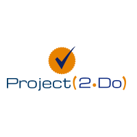

# Project-2 

## Project 2 Do <h2>

The main idea behid Project 2 is to create a kanban web application for tasks and things to do with your friends and/or family. 

The user will have to register in order to use the web application. 

# User then will be able to:

1. View all tasks.
2. Create a new task.
3. Check on the current weather.
4. Select a task to do based on the current weather.
5. Move a task from 'To Do" into 'In Progress' or 'Done' state.
6. Sign out!

## Snapshot of our web app below!

# Technologies Utilized

* ZURB Foundation
* DarkSky-API
* Sequelize
* Passport - NPM Package
* B-Crypt JS
* Express-session
* NODE-Mon
* EsLint

*Dev Team*
UW Bootcamp 2019
Saranda Sharpe, Kevin Joun, Eddie DePaolo, Angelo DePaolo, Meika Prince
